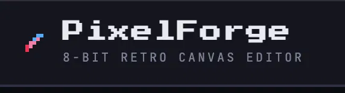

<div align="center">



<br />

**A dark, distraction-free pixel art editor that runs entirely in your browser.**
**No build step. No dependencies. No servers. Just `index.html`.**


</div>

---

## What is PixelForge?

PixelForge is a self-contained sprite editor for anyone who wants to draw pixel art without installing anything or fighting a bloated app. Open one HTML file, and you get a resizable grid canvas, a real 8-bit reference palette, a bucket-fill tool, and one-click export to PNG or JSON.

It's built for:

- 🎮 Game devs who need quick sprites, tilesets, or icons
- 🖼️ Anyone who wants a lightweight pixel art scratchpad
- 🧑‍💻 Developers who want a clean, readable vanilla-JS codebase to learn from or fork

---

## Features

| | |
|---|---|
| 🧱 **Resizable canvas** | Presets for 8×8, 16×16, 32×32, and 64×64 — or set any custom size up to 64×64 |
| 🎨 **8-bit palette** | 16 hand-picked retro colors, plus a full custom color picker |
| 🖌️ **Brush, Eraser & Bucket Fill** | Click-and-drag painting, one-click flood fill with contiguous-region detection |
| #️⃣ **Toggleable gridlines** | Switch between a guided grid and a clean, gridline-free view |
| 🧹 **Instant clear** | Wipe the canvas back to a blank slate in one click (with a confirmation guard) |
| 🖼️ **Crisp PNG export** | Upscaled, anti-aliasing-free export with a transparent background — ready to drop straight into a game engine |
| 💾 **JSON export & import** | Save your artwork as structured, human-readable JSON and reload it anytime |
| 📱 **Responsive & touch-ready** | Works down to phone width, with full touch-drag support |
| ⚡ **Zero-lag drawing** | Direct DOM updates and event delegation keep drawing smooth even at 64×64 (4,096 cells) |

---

## Quick Start

No installation, no `npm install`, no build tools.

```bash
git clone https://github.com/your-username/pixelforge.git
cd pixelforge
```

Then just open `index.html` in any modern browser:

```bash
# macOS
open index.html

# Windows
start index.html

# Linux
xdg-open index.html
```

Or, if you prefer a local server (not required, but avoids any browser file:// quirks):

```bash
python3 -m http.server 8000
# then visit http://localhost:8000
```

That's it — you're drawing.

---

## How to Use It

### Drawing
- **Left-click** a cell to paint it with the active color
- **Click and drag** to paint continuously across cells
- Releasing the mouse button *anywhere* — even outside the canvas — safely stops painting

### Tools

| Tool | Behavior |
|---|---|
| **Brush** | Paints cells with the active color |
| **Eraser** | Resets cells back to transparent/background |
| **Fill** | Flood-fills the clicked region — every contiguous cell of the same color — with the active color |

### Colors
Pick from the 16-color retro palette on the left, or use the native color picker for any custom hex value. The active color is always highlighted so you know exactly what you're about to paint with.

### Canvas Size
Choose a preset (8×8 / 16×16 / 32×32 / 64×64) or type a custom size (1–64) and hit **Apply**. If your canvas already has artwork on it, PixelForge asks for confirmation before resizing, since changing dimensions clears the grid.

### Exporting

- **Export PNG** — renders your grid onto a hidden canvas at 16px-per-pixel, with smoothing disabled, so the download is crisp and never blurry. Empty cells export as transparent, so sprites drop cleanly onto any background.
- **Export JSON** — saves the raw grid state (size + cell colors) as a `.json` file, useful for version control, backups, or loading artwork into your own tools.
- **Import JSON** — reload a previously exported `.json` file. PixelForge validates the file's structure before touching your canvas, so a malformed file can't corrupt your session.

**JSON format:**

```json
{
  "app": "PixelForge",
  "version": 1,
  "size": 16,
  "cells": ["#FF004D", null, null, "#29ADFF", "..."]
}
```

`cells` is a flat, row-major array of length `size × size`. Each entry is either a `#RRGGBB` hex string or `null` for an empty pixel.

---

## Project Structure

```
pixelforge/
├── index.html      # Markup — sidebar controls, canvas viewport, status bar
├── style.css        # Dark 8-bit theme, layout, responsive rules
├── app.js           # All application logic — state, painting, export/import
├── assets/
│   └── logo.png      # Project logo
└── README.md
```

Everything lives in three files, deliberately. There's no bundler, no framework, no `node_modules` — just readable, well-commented vanilla JavaScript.

---

## Under the Hood

A few implementation details worth knowing if you're extending the code:

- **Event delegation** — a single `mousedown`/`mouseover` listener on the grid container handles every cell, instead of thousands of individual listeners. Resizing the grid just rebuilds DOM nodes; there's nothing to leak.
- **Direct DOM updates** — painting a cell updates that cell's `style.backgroundColor` directly rather than re-rendering the grid, keeping input latency effectively zero even at 64×64.
- **Stack-based flood fill** — an iterative (non-recursive) flood fill, so filling a large region on a 64×64 canvas never risks a stack overflow.
- **Global mouseup/blur guards** — painting state is reset from a `window`-level listener, so dragging off-canvas or releasing outside the browser window can never leave the app stuck in "paint" mode.
- **Validated imports** — every imported JSON file is checked for correct size bounds, array length, and valid hex colors before it's applied, with a non-blocking toast on failure.

---

